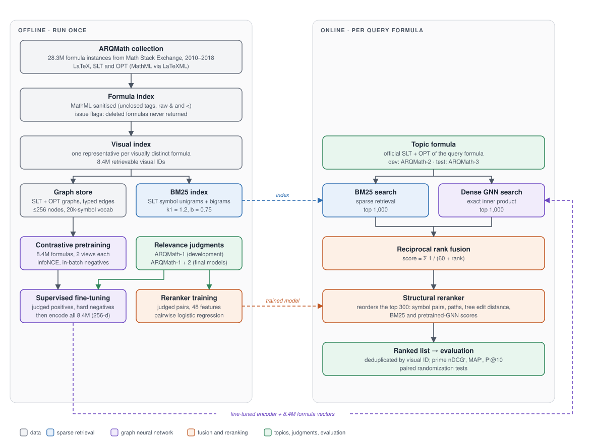

# Formula Search on ARQMath

Final project for **COS 587 – Introduction to Information Retrieval**, University of Southern Maine.

The project studies **mathematical formula retrieval**: given a formula taken from a Math Stack Exchange
question, find formulas in the Math Stack Exchange archive (2010–2018) that a reader would consider
relevant. This is Task 2 of the [ARQMath](https://www.cs.rit.edu/~dprl/ARQMath/) lab, whose collection,
queries and relevance judgments are used throughout.

The system encodes each formula's two tree representations, the **Symbol Layout Tree** (SLT, how the
formula looks) and the **Operator Tree** (OPT, what it computes), with a dual-branch graph neural network,
pretrained contrastively on the 8.4M-formula corpus and fine-tuned on ARQMath relevance judgments. Its
results are fused with BM25 by reciprocal rank fusion and reordered by a learned structural reranker.



More figures in [`docs/figures/`](docs/figures/): the dual-branch [encoder](docs/figures/encoder.svg),
[pretraining and fine-tuning](docs/figures/training.svg), the [structural reranker](docs/figures/reranker.svg)
and the [experimental protocol](docs/figures/protocol.svg). They are generated by
`python docs/figures/make_figures.py`.

## Results

ARQMath-3 Task 2 (76 test topics, official prime measures), evaluated once, with every setting fixed on
ARQMath-2 beforehand:

| System | nDCG′ | MAP′ | P′@10 |
|---|---|---|---|
| BM25 (SLT symbols) | 0.604 | 0.396 | 0.579 |
| Fine-tuned GNN | 0.661 | 0.503 | 0.680 |
| BM25 + GNN, reciprocal rank fusion | 0.715 | 0.517 | 0.642 |
| **+ structural reranker (final system)** | **0.728** | 0.548 | 0.675 |
| *DPRL TangentCFT2ED, best automatic ARQMath-3 run* | 0.694 | 0.480 | 0.611 |
| *approach0 fusion_alpha05, best ARQMath-3 run (manual)* | 0.720 | 0.568 | 0.688 |

- The final system is fully automatic and uses the formula only. It is above every automatic ARQMath-3
  run on all three measures (p ≤ 0.033 against TangentCFT2ED, paired randomization test) and not
  significantly different from approach0's manual run.
- All three of our systems beat BM25 on every measure (p ≤ 0.007); the reranker improves on fusion
  (nDCG′ p = 0.020, MAP′ p = 0.005), as it did on ARQMath-2 under 5-fold cross-validation.
- On ARQMath-2, pretraining variants (batch size, renaming rate) were indistinguishable from a
  schedule-matched control, and extra reranker features (variable co-reference, IDF weighting, longer
  paths) or reranking deeper than 200 candidates added nothing.
- Our run was not part of the ARQMath judgment pools: 85% of its top 10 is judged, against 97–100% for
  the leading submitted runs. Prime measures ignore unjudged formulas, as ARQMath recommends for such runs.


## Data

All data comes from ARQMath (collection v1.3, formula index v3). File-level details (formats, columns,
ID spaces, known issues) are in [`docs/DATA_ACQUISITION.md`](docs/DATA_ACQUISITION.md).

| | |
|---|---|
| Formula instances | 28,320,920 |
| with SLT and OPT (LaTeXML 0.8.5) | 28,267,310 |
| flagged `d` / `dv` (must not be returned) | 4,075,801 |

Queries and judgments come from the three ARQMath Task 2 years. Topics are drawn from posts made after
2018, so none of the queries appear in the collection.

| Year | Role | Judged topics (official / all) |
|---|---|---|
| ARQMath-1 (2020) | training | 45 / 74 |
| ARQMath-2 (2021) | development: every choice is made here | 58 / 70 |
| ARQMath-3 (2022) | test, run once for the final numbers | 76 / 86 |

The final models are retrained on ARQMath-1 + 2 with the settings chosen on ARQMath-2 (step 17).

Things that are easy to get wrong with this data (each was verified against the collection):

- **Visual IDs.** Task 2 is judged at the level of *visual IDs* (groups of formulas that look identical).
  ARQMath-2 and ARQMath-3 qrels use the index's `visual_id` column. The ARQMath-1 visual-ID qrels use an
  older numbering that does not exist in the v3 index, so ARQMath-1 is re-keyed from its formula-ID qrels
  (`scripts/convert_arqmath1_qrels.py`).
- **Issue flags.** Formulas flagged `d` are missing from the post XML and must never be returned;
  `v` only marks a corrected visual ID and the formula is usable. Both are stored in the index.
- **Topic formulas.** Queries use ARQMath's official SLT/OPT for each topic's `Formula_Id`. The ARQMath-3
  topic SLT contains unescaped `<` characters that break strict XML parsing for several judged topics and
  must be sanitised before use.

## Evaluation

Runs follow the official ARQMath Task 2 protocol:

- results are deduplicated by visual ID and `d`-flagged formulas are excluded;
- unjudged visual IDs are removed before scoring ("prime" metrics);
- reported metrics are **nDCG′** (graded relevance), **MAP′** and **P′@10** (grades 2–3 count as relevant),
  computed over every topic in the official qrels.

Systems retrieve **visual IDs** from a corpus with one representative formula per retrievable visual ID
(`src/data/visual_index.py`) and write TREC-format run files. `src/eval/metrics.py` computes the metrics
above with `pytrec_eval`, matching the organizers' settings. It also reports **judged@10**, the share of
the unfiltered top 10 that is judged: prime metrics only rank judged formulas (a random ordering of all
judged formulas already scores nDCG′ ≈ 0.64 on ARQMath-2), so they need to be read alongside it.

The official scripts (`de_duplicate_2022.py`, `task2_get_results.py`) are downloaded by `setup.sh`.
`--official` runs them on the same run for comparison; they require the `trec_eval` binary. Every
judged topic counts, and a topic for which a system returns no judged formula scores 0. `--official`
passes `-c` to `trec_eval` for the same behaviour; without it, current `trec_eval` stops with
"result qid … not found in qrels" on such a topic.

## Reproducing everything

`scripts/reproduce.sh` runs the final protocol end to end after step 1 below: download, indexes,
pretraining, fine-tuning, the dev runs that select every setting, the final models on ARQMath-1 + 2, and
(only with `--test`) the single ARQMath-3 evaluation. Settings passed from dev to the final models (the
fine-tuning step, the reranker's C, depth and α) are read from the dev outputs, not hard-coded. Each stage
logs to `logs/reproduce/<stage>.log` and is skipped on a rerun once done.

```bash
bash scripts/reproduce.sh --dry-run --test   # print every command
bash scripts/reproduce.sh                    # all stages up to the final models
bash scripts/reproduce.sh --test             # then the test run and the published-run check
bash scripts/reproduce.sh --from dev         # redo a stage and everything after it
```

GPU training is not bit-for-bit deterministic, so a rerun should land close to, not exactly on, the
numbers above. The exploratory runs (pretraining variants, reranker feature and depth ablations) are not
part of the script; their commands are in the steps below.

## Setup and full pipeline

Data and training live on a GPU server. Every command below runs from the repository root there, in
order; each step depends on the ones before it.

**1. Python environment** (once; versions are pinned from the server's Python 3.8 environment)

```bash
python3 -m venv .venv
source .venv/bin/activate
pip install -r requirements.txt
```

**2. Download ARQMath** (≈1.8 GB compressed, ≈21 GB unpacked; formula indexes, topics, topic formulas,
qrels, official eval scripts)

```bash
bash scripts/setup.sh
```

**3. Build the Parquet formula index** (~15 min) → `data/processed/formula_index_v2/`

```bash
python -m src.data.index
```

**4. Re-key the ARQMath-1 qrels to v3 visual IDs** (seconds) → `data/processed/qrels/task2/arqmath1/`

```bash
python scripts/convert_arqmath1_qrels.py
```

**5. Build the visual-ID retrieval corpus** → `data/processed/visual_index/`. Also reports how many
relevant visual IDs are not retrievable (the recall ceiling) for each year.

```bash
python -m src.data.visual_index
```

**6. BM25 baseline**: build the index (→ `data/processed/bm25/`), then retrieve for the dev topics
(→ `runs/bm25_dev.tsv`)

```bash
python -m src.baselines.bm25 build
python -m src.baselines.bm25 search --split dev
```

**7. Evaluate**

```bash
python -m src.eval.evaluate runs/bm25_dev.tsv --split dev
```

**8. Cross-check against the official ARQMath scripts** (once; builds `trec_eval`, no sudo needed)

```bash
git clone https://github.com/usnistgov/trec_eval.git ~/trec_eval
make -C ~/trec_eval
python -m src.eval.evaluate runs/bm25_dev.tsv --split dev --official --trec-eval ~/trec_eval/trec_eval
```

**9. Score the published ARQMath-3 runs** (once): downloads the 20 runs submitted to ARQMath-3 Task 2,
converts them to visual-ID runs in `runs/published/`, and scores them. The results should match Table 4 of
the ARQMath-3 overview, e.g. DPRL's Tangent-CFT run (`DPRL-Task2-CFT-auto-math-A`): nDCG′ 0.641,
MAP′ 0.419, P′@10 0.534. Scoring other systems on the test topics validates the evaluation and does not
inform any of our own choices.

```bash
bash scripts/setup.sh --with-runs
python -m src.eval.import_run data/raw/arqmath/runs/arqmath3/task2/*.tsv
for f in runs/published/*.tsv; do python -m src.eval.evaluate "$f" --split test; done
```

**10. Graph vocabularies and statistics**: converts every visual ID to its SLT and OPT graphs
(`src/data/formula_graph.py`), writes the symbol/tag vocabularies to `data/processed/graph_vocab.json`
and graph-size statistics to `data/processed/reports/graph_stats.json`.

```bash
python -m src.data.graph_stats
```

**11. Pretraining graph store**: converts both graphs of every visual ID once into memory-mapped integer
arrays in `data/processed/pretrain_graphs/` (≈256-node cap), so contrastive pretraining does not parse
MathML every epoch.

```bash
python -m src.pretrain.graph_store
```

**12. Contrastive pretraining** (GPU; settings in `configs/pretrain.yaml`). Run the short smoke test first
to check throughput, then the full run (in `tmux` or with `nohup`, since it takes hours). Checkpoints and
`log.jsonl` go to `checkpoints/pretrain/`; `--resume checkpoints/pretrain/latest.pt` continues a run.

```bash
python -m src.pretrain.train --max-steps 200 --eval-every 100 --out-dir checkpoints/pretrain_smoke
python -m src.pretrain.train
```

The model used downstream, `checkpoints/pretrain_rename04/best_rename04.pt`, was trained with
`configs/pretrain_selected.yaml` (`p_rename` 0.4, a 5,000-step schedule; best quick-dev checkpoint at
step 4,000):

```bash
python -m src.pretrain.train --config configs/pretrain_selected.yaml --out-dir checkpoints/pretrain_rename04
cp checkpoints/pretrain_rename04/best.pt checkpoints/pretrain_rename04/best_rename04.pt
```

**13. Full-corpus retrieval with a checkpoint**: embeds all 8.4M formulas (cached next to the checkpoint,
~4.3 GB), retrieves the top 1,000 per topic and writes `runs/gnn_<checkpoint>_<split>.tsv`; score it with
step 7. Inference fits on a 12 GB GPU, so it can run on a second GPU while training continues.

```bash
CUDA_VISIBLE_DEVICES=1 python -m src.model.retrieve --checkpoint checkpoints/pretrain/best.pt --split dev
python -m src.eval.evaluate runs/gnn_best_dev.tsv --split dev
```

**14. Compare and fuse runs.** `compare` reports per-measure differences against a baseline run with a
paired randomization test, bootstrap 95% intervals and per-topic wins/losses. `fuse` combines runs
(min-max linear or reciprocal rank fusion); with `--tune` it picks the weight on the split's topics and
`--cv` gives a cross-validated estimate. Tune fusion weights on `dev` and reuse them unchanged on `test`.

```bash
python -m src.eval.compare runs/bm25_dev.tsv runs/gnn_best_dev.tsv --split dev --topics 5
python -m src.eval.fuse runs/bm25_dev.tsv runs/gnn_best_dev.tsv --split dev --tune --cv 5 --out runs/fused_dev.tsv
```

**15. Supervised fine-tuning** (GPU; `configs/finetune.yaml`): starts from a pretrained checkpoint and
trains on ARQMath-1 judgments: each batch has 64 distinct topics, each with its official query formula,
one relevant formula (grade 2–3) and one judged non-relevant formula (grade 0–1) as a hard negative.
Checkpoints are selected with the quick dev check, which also runs before the first step for reference.

```bash
python -m src.finetune.train --out-dir checkpoints/finetune_pa05
cp checkpoints/finetune_pa05/best.pt checkpoints/finetune_pa05/best_ft_pa05.pt
python -m src.model.retrieve --checkpoint checkpoints/finetune_pa05/best_ft_pa05.pt --split dev
python -m src.eval.fuse runs/bm25_dev.tsv runs/gnn_best_ft_pa05_dev.tsv --method rrf --run-id rrf_ft_pa05 \
    --out runs/rrf_ft_pa05_dev.tsv
```

**16. Structural reranker.** Reorders the first-stage top-k with a linear pairwise model over
structural features (Tangent-style symbol-pair and path overlap at exact / unified-variable / structure
level, tree edit distance, size) plus BM25 and *pretrained*-GNN scores; the fine-tuned GNN's scores
are not used as features because they are inflated on its own ARQMath-1 training topics. Trained on
ARQMath-1 judged pairs; regularisation, depth and interpolation with the first stage are chosen on dev.

A second feature group ("proto") ports the ideas of the earlier prototype's hand-written reranker as
learnable features: variables renamed by first appearance (keeps co-reference: x·x ≠ x·y), three-edge
paths, IDF-weighted overlap (document frequencies from a 100k-formula corpus sample, cached in
`data/processed/rerank/idf_100000_0.npz`) and tree edit distance with commutative operands sorted.
`--features base|all` trains without or with it, for the ablation.

```bash
python -m src.rerank.build --split train --judged --qrels all --name train_judged
python -m src.rerank.build --split dev --run runs/rrf_ft_pa05_dev.tsv --depth 500 --name dev_rrf_ft
python -m src.rerank.train --train data/processed/rerank/train_judged.npz --dev data/processed/rerank/dev_rrf_ft.npz \
    --dev-run runs/rrf_ft_pa05_dev.tsv --split dev --features base --model-out data/processed/rerank/model_base.json \
    --out runs/reranked_base_dev.tsv --cv 5 --cv-out runs/reranked_base_cv_dev.tsv
python -m src.rerank.train --train data/processed/rerank/train_judged.npz --dev data/processed/rerank/dev_rrf_ft.npz \
    --dev-run runs/rrf_ft_pa05_dev.tsv --split dev --features all --model-out data/processed/rerank/model_all.json \
    --out runs/reranked_all_dev.tsv --cv 5 --cv-out runs/reranked_all_cv_dev.tsv
python -m src.eval.compare runs/rrf_ft_pa05_dev.tsv runs/reranked_base_cv_dev.tsv runs/reranked_all_cv_dev.tsv --split dev
```

The selected setting's dev score is optimistic (chosen on the same topics); `--cv 5` reranks each fold of
dev topics with the setting chosen on the other folds, an honest estimate to report and compare.

Tune on `dev` only. Run `search --split test` and evaluate on `test` only for final numbers.

**17. Final models and the test run** (once, at the end). With every setting fixed on dev, fine-tuning
and the reranker are retrained on ARQMath-1 + ARQMath-2 judgments (144 topics). Quick dev cannot select
checkpoints any more (it would score training topics), so fine-tuning reruns the dev run's configuration
and stops at the step dev selected (`--stop-at`, read from the dev checkpoint); the reranker is trained
with the dev-chosen C, depth and α (`--fixed`). Then the whole pipeline runs once on ARQMath-3.

```bash
python -c "import torch; c = torch.load('checkpoints/finetune_pa05/best_ft_pa05.pt', map_location='cpu'); print(c['step'], c['config'])"
python -m src.finetune.train --split train+dev --no-quick-dev --stop-at <STEP> --out-dir checkpoints/finetune_final
python -m src.rerank.build --split train+dev --judged --qrels all --name train_dev_judged
python -m src.rerank.train --train data/processed/rerank/train_dev_judged.npz --features base --fixed 0.1 300 1.0 \
    --model-out data/processed/rerank/model_final.json

python -m src.baselines.bm25 search --split test
python -m src.model.retrieve --checkpoint checkpoints/finetune_final/final.pt --split test --run-id gnn_ft_final
python -m src.eval.fuse runs/bm25_test.tsv runs/gnn_ft_final_test.tsv --method rrf --run-id rrf_final --out runs/rrf_final_test.tsv
python -m src.rerank.build --split test --run runs/rrf_final_test.tsv --depth 300 --name test_rrf_final
python -m src.rerank.train --apply data/processed/rerank/model_final.json --dev data/processed/rerank/test_rrf_final.npz \
    --dev-run runs/rrf_final_test.tsv --out runs/reranked_final_test.tsv

python -m src.eval.compare runs/bm25_test.tsv runs/gnn_ft_final_test.tsv runs/rrf_final_test.tsv runs/reranked_final_test.tsv --split test
python -m src.eval.evaluate runs/reranked_final_test.tsv --split test --official --trec-eval ~/trec_eval/trec_eval
```

**Optional diagnostics** (after step 3; their findings are summarised under [Data](#data)):

```bash
python scripts/check_qrel_ids.py          # which index column each qrel file is keyed on
python scripts/inspect_flagged_xml.py     # whether 'v'-flagged formulas carry the right SLT
```

## Repository layout

```
docs/
  DATA_ACQUISITION.md        data sources, formats and known issues
  figures/                   system figures (SVG) and make_figures.py, which draws them
scripts/
  setup.sh                   download ARQMath into data/raw/arqmath/
  reproduce.sh               the whole experiment, stage by stage (see Reproducing everything)
  convert_arqmath1_qrels.py  ARQMath-1 qrels: formula IDs → v3 visual IDs
  check_qrel_ids.py          diagnostic: qrel ID space per file
  inspect_flagged_xml.py     diagnostic: SLT/LaTeX consistency of flagged formulas
  inspect_graph_failures.py  diagnostic: why SLT/OPT graphs fail to build
src/
  data/
    paths.py                 data locations; train/dev/test = ARQMath-1/2/3
    index.py                 build the Parquet formula index from the ARQMath TSVs
    visual_index.py          build the visual-ID retrieval corpus
    mathml.py                parse and canonicalise ARQMath MathML
    topics.py                topics with their official query SLT/OPT
    qrels.py                 relevance judgments keyed by visual ID
    formula_graph.py         SLT/OPT graphs: symbol nodes, typed edges; vocabularies; PyG input
    graph_stats.py           build graph vocabularies and size statistics from the corpus
  eval/
    metrics.py               nDCG′ / MAP′ / P′@10 (prime), judged@10
    runs.py                  run files and official submission files
    official.py              scoring with the organizers' scripts
    evaluate.py              command line: score a run file
    import_run.py            convert official ARQMath run files to visual-ID runs
    compare.py               paired significance tests and per-topic comparison of runs
    fuse.py                  linear / reciprocal rank fusion of runs, weight tuning with cross-validation
    extra_metrics.py         bpref and nDCG / MAP / P at 5, 10, 100, 1000 (prime and standard), beyond the official measures
  pretrain/
    graph_store.py           graphs of every visual ID as memory-mapped arrays
    augment.py               training views: variable renaming, number changes, crops, dropped graph
    dataset.py               positive pairs of views and PyG batching
    train.py                 contrastive pretraining loop
  finetune/
    data.py                  query / positive / hard-negative triples from judgments, topic-distinct batches
    train.py                 supervised fine-tuning loop
  model/
    encoder.py               dual-branch GATv2 encoder (SLT + OPT → one 256-d vector)
    loss.py                  symmetric InfoNCE with learnable temperature
    quick_dev.py             fast dev check during training (judged + random distractors)
    retrieve.py              full-corpus retrieval with a checkpoint → run file
  rerank/
    tree_edit.py             Zhang–Shasha tree edit distance
    features.py              structural query–candidate similarity features (base + proto groups, IDF table)
    build.py                 feature files for judged pairs or first-stage candidates
    train.py                 pairwise linear reranker: training, selection on dev, applying
  baselines/
    bm25.py                  BM25 over SLT symbols
configs/                     pretraining (default and selected) and fine-tuning settings
data/
  raw/arqmath/               downloaded data (not tracked)
  processed/                 generated index, qrels and reports (not tracked)
  samples/                   small fixtures for local testing
```

## References

- B. Mansouri, R. Zanibbi, D. W. Oard, A. Agarwal. *Overview of ARQMath-3 (2022): Third CLEF Lab on
  Answer Retrieval for Questions on Math.* CLEF 2022 Working Notes.
- B. Mansouri, S. Rohatgi, D. W. Oard, J. Wu, C. L. Giles, R. Zanibbi. *Tangent-CFT: An Embedding Model for
  Mathematical Formulas.* ICTIR 2019.
- W. Zhong, Y. Xie, J. Lin. *Applying Structural and Dense Semantic Matching for the ARQMath Lab 2022, CLEF.*
  CLEF 2022 Working Notes (approach0).
- R. Zanibbi, B. Mansouri, A. Agarwal. *Mathematical Information Retrieval: Search and Question Answering.*
  Foundations and Trends in Information Retrieval 19(1–2), 2025.
